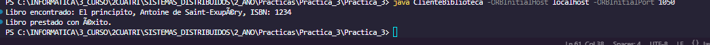
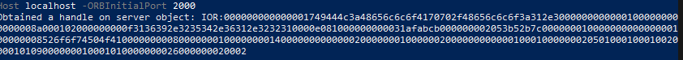

# Practica 3Sistemas Distribudios
## José María Fernández
### 2024
### Universidad Antonio De Nebrija
---
## Introducción
En esta Práctica se ha desarrollado un sistema de cliente servidor empleando CORBA.
Este sistema simula el servidor y los clientes de una blblioteca, se puede buscar un libro, prestar un libro
o devolver un libro.
### Usage
```
 cd .\Practica_3\
 ```
```
idlj -fall Biblioteca.idl
```
```
javac ServidorBiblioteca.java
```
javac ClienteBiblioteca.java
```
tnameserv -ORBInitialPort 1050
```
java ServidorBiblioteca -ORBInitialHost 1050 -ORBInitialPort localhost
```
java Client -ORBInitialHost localhost -ORBInitialPort 1050 
```

#### Imagenes Funcionamiento








[!Imagen](./ImagenesReadme/ResNumLib.PNG)
